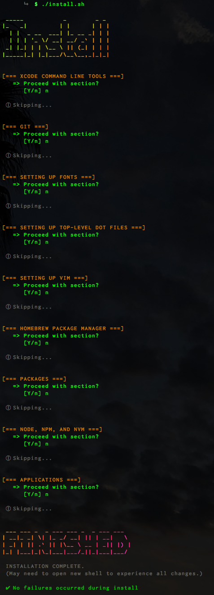

```
 __  __              ____       _
|  \/  | __ _  ___  / ___|  ___| |_ _   _ _ __
| |\/| |/ _` |/ __| \___ \ / _ \ __| | | | '_ \
| |  | | (_| | (__   ___) |  __/ |_| |_| | |_) |
|_|  |_|\__,_|\___| |____/ \___|\__|\__,_| .__/
                                        |_|
```

[](https://github.com/mcclayton/MacSetup)

**🚀 Complete Automated Mac Development Environment Setup 🚀**

## About

This repository contains an [install script](https://github.com/mcclayton/DotFiles/blob/master/install.sh) which, when run, will completely
set up a Macintosh machine configured to [Michael Clayton](https://github.com/mcclayton)'s preferred and opinionated development environment.
It will configure and install dot files, applications, packages, et cetera.

The script is designed to be interactive so users can still pick and choose what they want
to install/configure, however, you may still want to look through individual Dot Files and
pick/choose what you want at a more granular level.

This script is designed to be safe and can be run multiple times.

## Usage

Simply run the [install script](https://github.com/mcclayton/DotFiles/blob/master/install.sh) via the command:

```bash
$ ./start.sh

# 1) Sandbox (Docker)
# 2) Current Machine
# 3) Quit
#    => Choose Execution Environment:
```

This will present the user with a choice to run the installer in one of two modes.
1. **Sandbox Environment**
      Installation/Setup changes are made in a dockerized sandbox environment and will not affect the current actual machine.
2. **Current Machine**
      Installation/Setup changes made in this environment will modify and affect the current actual machine.


